# FIFA-Career-Dashboard-Frontend

FC24 Career Dashboard:

## Table of Contents

- [Features](#features)
- [Installation](#installation)
    - [Dependencies](#dependencies)
    - [Usage](#usage)
- [Change log](#change-log)
- [Important Note && Tips](#important-note--tips)

## Features

- View all players in your team, monitor their overall rating, potential.
- View players' trends of overall rating, potential.
- Silent operation, real-time updates (weekly in-game updates, configurable)
- Player details page
- Notification when a player's overall rating or potential changes

And more features are coming soon.

- Notification when a player's weak foot or skill moves changes

## Installation

### Dependencies

- Latest **xAranaktu/FC-24-Live-Editor**. (
  Click [here](https://www.patreon.com/collection/96422?view=expanded) to
  download)
- **Secret API key**. (Get it from the settings page)
- [**lua code snippet**](./lua-scripts/client-script.lua)

> Actually, you don't need to download the lua code snippet and replace the API
> key.
> I put everything in the GetStarted page, you can directly copy the code
> snippet and paste it into the Live Editor of your FC24.

### Usage

- Open the FC24 with Live Editor.
- Go to the Lua script tab in the live editor.
- Paste the code snippet in GetStarted page.
- Click the "Execute" button. It will send a init request to the backend.
- You can see the player list in the player list page.

# Change log

## Latest version 1.2.0:

- New player details page
- Notification when a player's overall rating or potential changes
- New login page

Player trends:

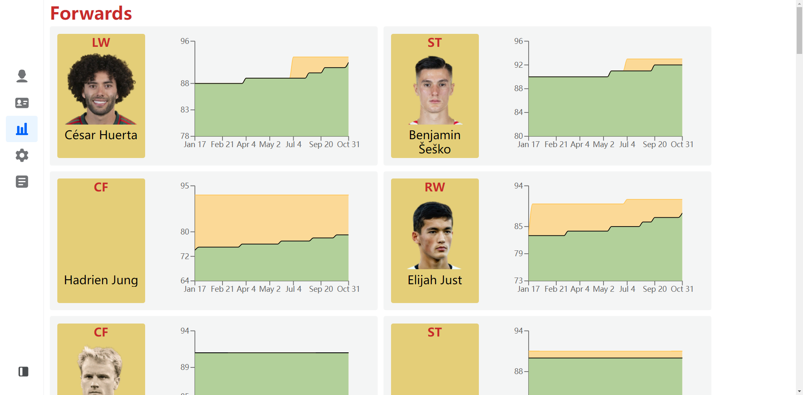

Player details:

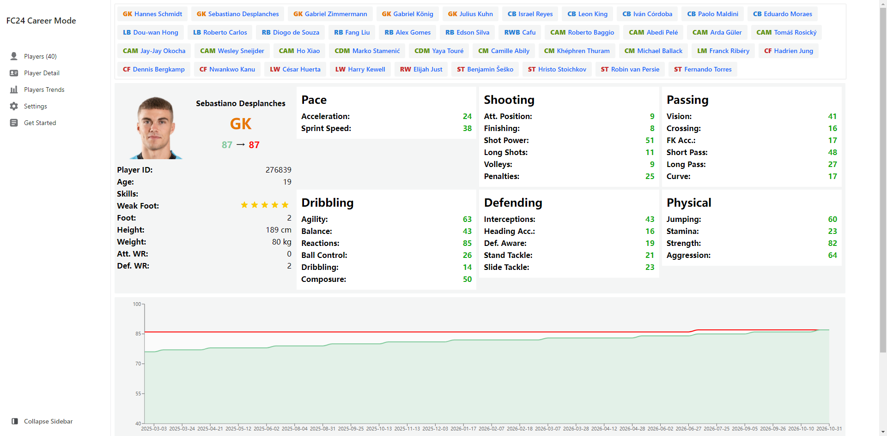

Notification when a player's overall rating or potential changes:

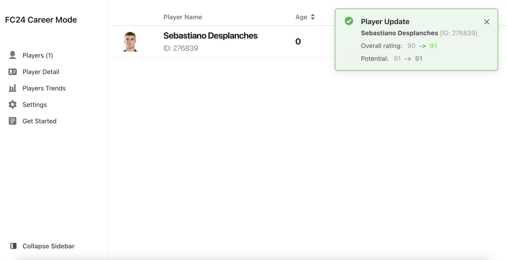

Player list:

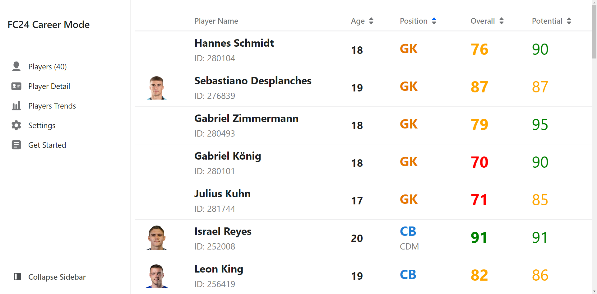

Login page:

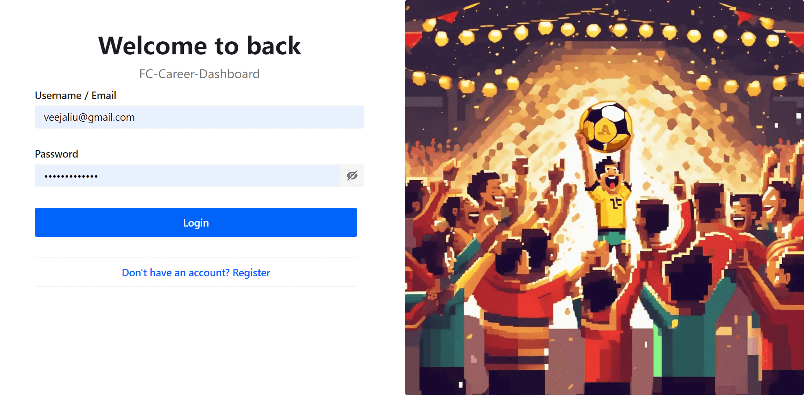

## Older versions:

    
expand to view

### OLD Version 1.1.0:

- Add Login page
- Add settings page(Secret key Management, Logout)
- Add get started page(How to use)

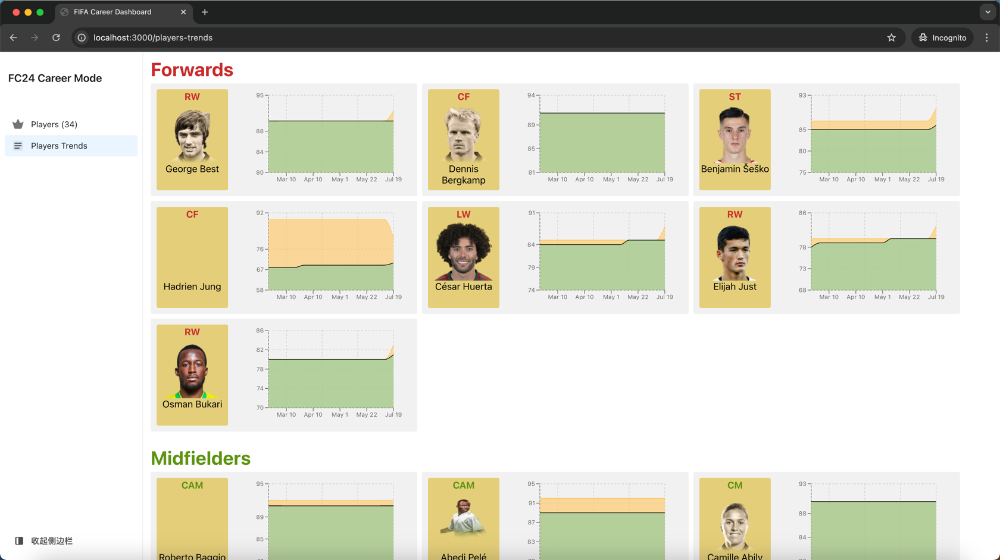

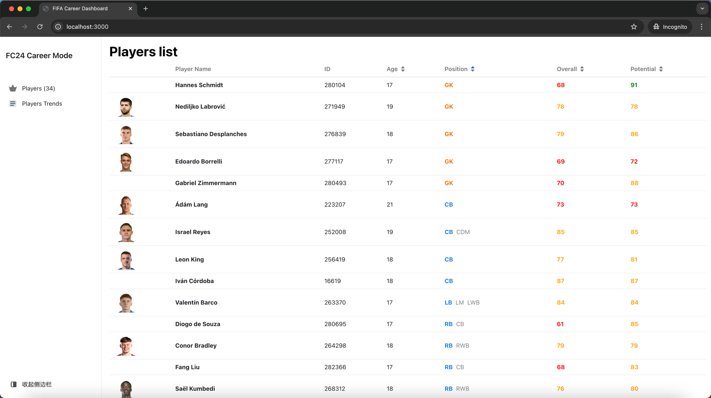

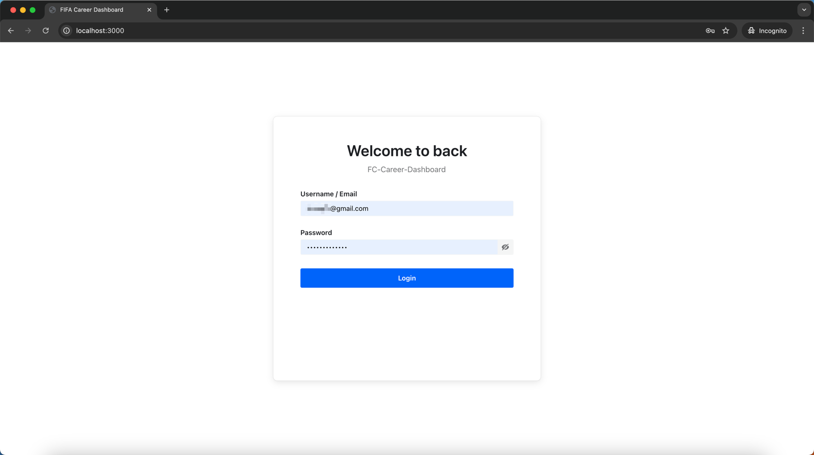

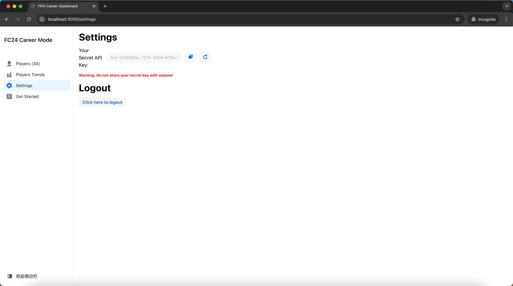

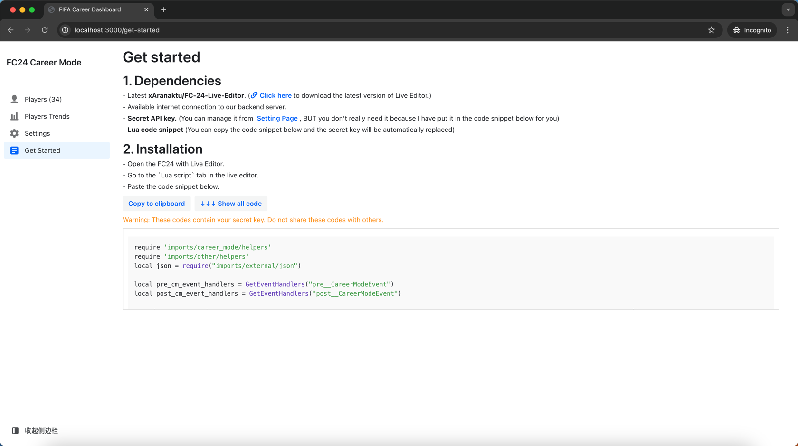

### OLD Version 1.0.1:

- Change the player trends chart style.

### OLD Version 1.0.0:

Player list:
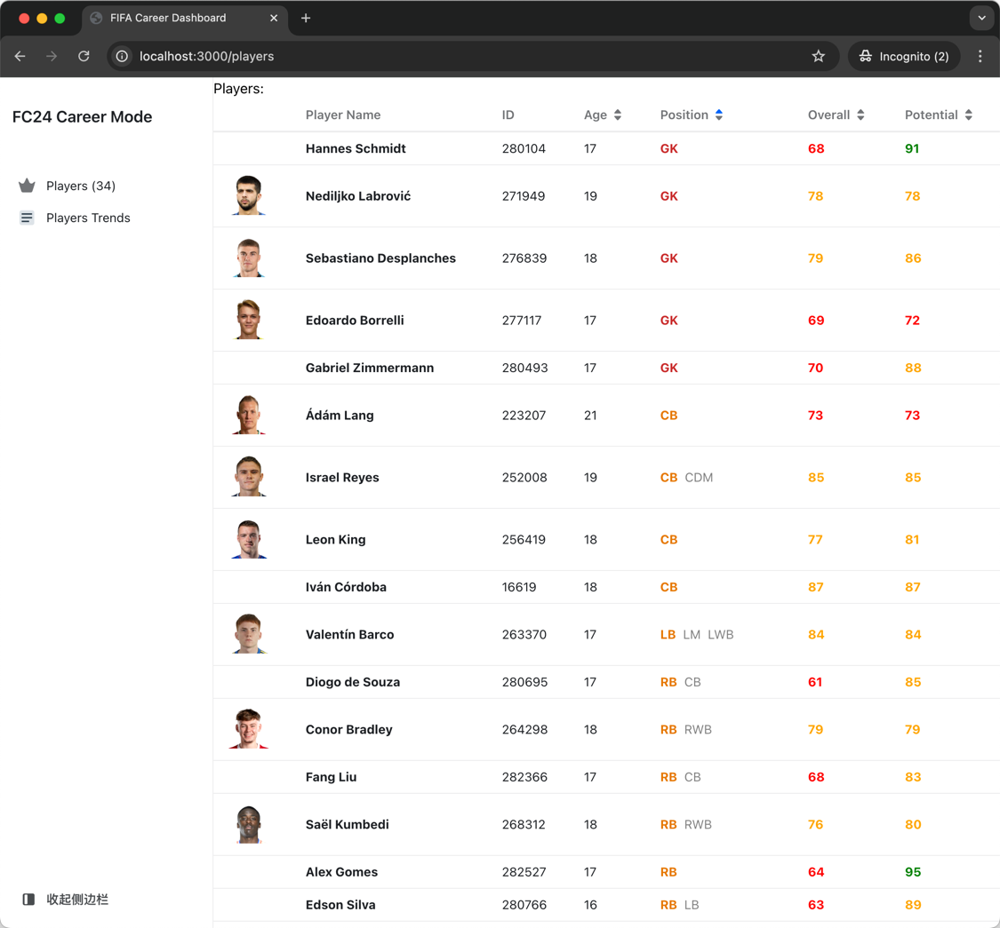

Player trends:
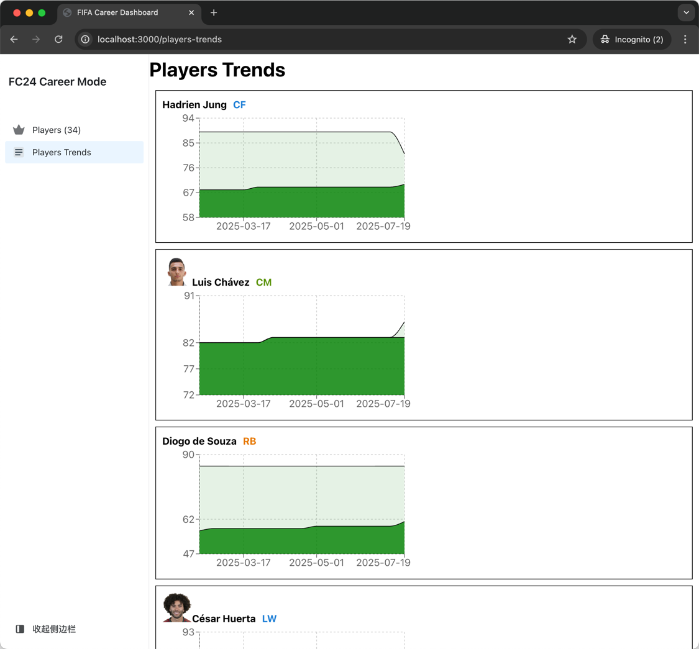

## Important Note && Tips

### 1. In-game Date Might Not Be Perfectly Accurate!

You might have noticed that we’re tracking player stat growth as the in-game
time changes.
BUT here’s a little secret: it’s tricky for us to get the exact in-game date!
We used to pull that data from the “career_table” you can find in the Live
Editor under the Table tab. But after a certain game update, the data in that
table isn’t accurate anymore. Interestingly, I found a pattern: the table is
accurate when you first enter Career Mode or after you play a match. So,
based on that, we had to create a manual time calculation method by listening
to the DAY_PASSED event in the game and cross-referencing it with the data we
can still get. It’s a bit clunky, and I had to add a bunch of redundant code
to make it work. But for now, that’s our only option. So, when using this
script, don’t rely too heavily on the in-game date, as it might not be
spot-on.
And please, run this script immediately after entering Career Mode to get the
most accurate data possible. Otherwise, the data will only become accurate
after you play a match.
**Our Tip: Run this script right after entering Career Mode!**

### 2. The Annoying Black Window! It might steal your focus.

Let me explain how this works. Our application relies on the functions
provided by Live Editor. Whenever the WEEK_PASSED event is triggered in the
game, our Lua script runs, collecting data from all your current team players
and sending it to our server. But here’s the catch: Live Editor doesn’t offer
a way to send API requests directly to an external server, so we’re using
Windows’ Curl command to do that. Unfortunately, every time we run that
command, a black window pops up because we’re executing Curl in the Windows
system. And sometimes, this black window might steal focus from your game,
which is a bummer. It doesn’t happen every time, but it’s possible. It’s far
from perfect, but it’s the best we can do right now. I’m sorry about this
inconvenience, but I’m constantly searching for a better solution. So, while
using this application, please don’t close that black window—it’s busy
sending the API request. If your network isn’t too slow, the window should
disappear quickly. In my experience, it’s bearable since the black window
only pops up once per in-game week. And hey, it’s a small price to pay for
keeping track of your players’ progress, right? Rest assured, I’m on the
lookout for a better solution, and I’ll update the application as soon as we
find one. Thanks for your understanding!

### 3. Only One Save Slot Supported!

During the closed beta, we’re only supporting one save slot. This is because
our server resources are limited, and we can’t provide a separate save for
every single user. Plus, I doubt anyone is switching save files back and
forth that often, so I think this limitation is fair. In the future, we might
offer more save slots, but who knows? The future is full of surprises!

### 4. Issues Caused by Insufficient File System Permissions

Let me explain why this script requires file system permissions. As we
mentioned earlier, we use the command line to directly execute a curl command
to send your player data. However, due to the numerous player attributes, the
JSON data string can get very long, making it impossible to concatenate all
this data in a single line of curl, as it exceeds the command line's allowed
length. Therefore, what I do is write this data to a file first and then
concatenate the file's path in the command. Based on this, please ensure you
have administrative privileges and write permissions for the folder.
Generally, we will write to the root directory of the EA FC game, and if
writing fails, an error will be displayed: "Permission denied."
